# Architecture

This repository implements a **3-stage CLI pipeline** for converting city climate PDFs into structured records:

1. **PDF → Markdown** (`pdf2markdown/`)
2. **Markdown → Structured JSON** (`extraction/`)
3. **Foreign-key linking / record mapping** (`mapping/`)

The `database/` package provides a Postgres schema + migrations, but the pipeline’s default outputs are **JSON files under `output/`**.

---

## High-level pipeline

```mermaid
flowchart LR
    A[PDF files in documents/] -->|Stage 1| B[pdf2markdown: Mistral OCR]
    B --> C[Per-page markdown + images]
    C -->|optional| D[Vision refinement in 2-page sliding windows]
    D --> E[combined_markdown.md]

    E -->|Stage 2| F[extraction: tool-calling LLM]
    F --> G[One JSON file per schema class]

    G -->|Stage 3| H[mapping: clear FK fields → canonicalize city → LLM FK mapping]
    H --> I[Staged mapped JSON outputs]

    I -. optional .-> J["database: load into Postgres<br/>(not part of default pipeline)"]
```



---

## Entry points (what to run)

### Full pipeline orchestrator

- `run_pipeline.py`
  - Runs **stage 1 → stage 2 → stage 3**.
  - Writes all artifacts into the unified `output/` directory.

### Stage 1: PDF → Markdown

- CLI: `python -m pdf2markdown.pdf_to_markdown`
- Core pipeline: `pdf2markdown/utils/pdf_to_markdown_pipeline.py`

Key behavior:

- Uses **Mistral OCR** to produce per-page markdown and optional page images.
- If `--max-upload-bytes` is exceeded, the PDF is **split per page** (requires optional dependency `pypdf`) and OCR runs in parallel (up to 3 workers).
- If a vision model is configured, performs **pairwise refinement** (page \(n\), page \(n+1\)) and saves diffs under `vision_diffs/`.
- Emits a single `combined_markdown.md` as the input to extraction.

### Stage 2: Markdown → Structured JSON

- CLI wrapper: `python -m extraction.scripts.extract`
- Engine: `extraction/extract.py`
- Schemas: `database/schemas.py` (plus verified extraction variants in `extraction/schemas_verified.py`)
- Prompts: `extraction/prompts/`
- Tools: `extraction/tools/` (the extraction uses tool-calling to record instances)

Key behavior:

- Loads model settings from `llm_config.yml` (`extraction.*`) and runtime knobs from `extraction/config.yaml`.
- Extracts instances for each schema class (or a subset via `--class-names`).
- Writes JSON lists like `City.json`, `EmissionRecord.json`, etc.
- Keeps previously extracted records and uses a hash-based dedupe to avoid duplicates across rounds.

### Stage 3: Mapping (foreign key linking)

- CLI wrapper: `python -m mapping.scripts.mapping`
- Runner: `mapping/mapping.py`

Key behavior:

- **Step 1**: Clears potentially hallucinated FK fields from extraction outputs.
- **Step 2**: Canonicalizes the city record and applies the canonical `cityId` where required.
- **Step 3**: Uses an LLM to map remaining foreign keys (e.g., sector IDs, indicator IDs), then verifies FK presence.
- Writes staged outputs under the work directory (default `mapping/workflow_output/...`) when `--apply` is set, or runs as a dry-run otherwise.

---

## Configuration

### Model and provider config (shared)

- `llm_config.yml`
  - `pdf2markdown.*`: vision model and temperature, OCR model name
  - `extraction.*`: extraction model and temperature
  - `mapping.*`: mapping model and temperature

### Extraction runtime config

- `extraction/config.yaml`
  - `token_limit`: max tokens allowed in `combined_markdown.md`
  - `max_rounds`: tool-calling rounds per class
  - debug log settings

### Environment variables (typical)

- `MISTRAL_API_KEY`: required for OCR
- `OPENAI_API_KEY` or `OPENROUTER_API_KEY`: required for extraction and mapping (and for vision refinement via OpenRouter/OpenAI-compatible API)

---

## Output layout

The pipeline writes everything under `output/` at the repo root:

```text
output/
├── pdf2markdown/                # stage 1
│   └── YYYYMMDD_HHMMSS_<stem>/
│       ├── combined_markdown.md
│       ├── page-0001.md
│       ├── images/              # optional
│       └── vision_diffs/         # optional
├── extraction/                  # stage 2
│   ├── City.json
│   ├── EmissionRecord.json
│   └── ...
└── mapping/                     # stage 3 (work dir from run_pipeline.py)
    ├── step1_cleared/
    ├── step2_city/
    └── step3_llm/
```

---

## Database layer (optional)

The `database/` package contains:

- SQLAlchemy models under `database/models/`
- Alembic migrations under `database/alembic/`
- Migration runner `database/migrate.py`

This repo includes DB support for persistence and downstream querying, but **loading the pipeline JSON outputs into Postgres is not part of `run_pipeline.py` by default**.

---

**Last Updated:** 2026-02-02
