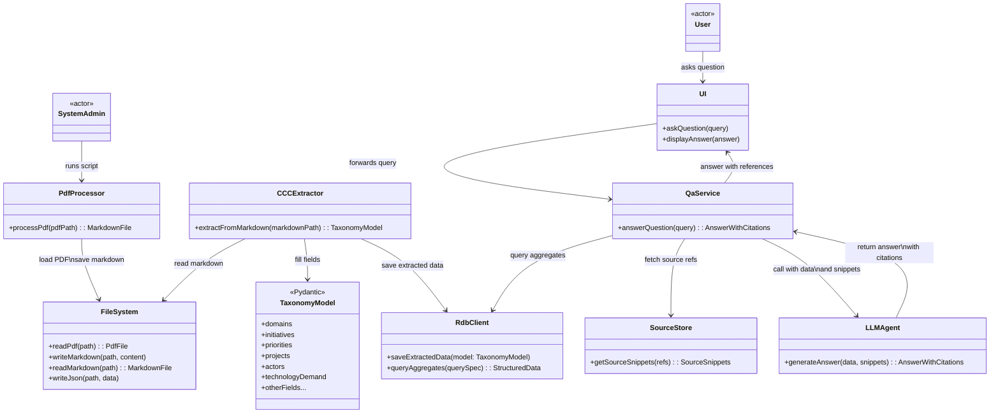
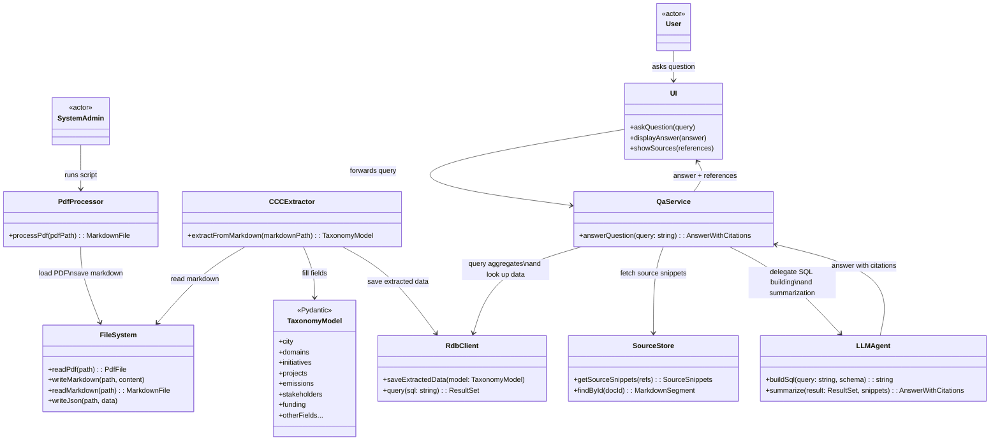

```mermaid
classDiagram

    class SystemAdmin {
      <<actor>>
    }

    class User {
      <<actor>>
    }

    class UI {
      +askQuestion(query)
      +displayAnswer(answer)
    }

    class PdfProcessor {
      +processPdf(pdfPath): MarkdownFile
    }

    class CCCExtractor {
      +extractFromMarkdown(markdownPath): TaxonomyModel
    }

    class TaxonomyModel {
      <<Pydantic>>
      +domains
      +initiatives
      +priorities
      +projects
      +actors
      +technologyDemand
      +otherFields...
    }

    class RdbClient {
      +saveExtractedData(model: TaxonomyModel)
      +queryAggregates(querySpec): StructuredData
    }

    class SourceStore {
      +getSourceSnippets(refs): SourceSnippets
    }

    class QaService {
      +answerQuestion(query): AnswerWithCitations
    }

    class LLMAgent {
      +generateAnswer(data, snippets): AnswerWithCitations
    }

    class FileSystem {
      +readPdf(path): PdfFile
      +writeMarkdown(path, content)
      +readMarkdown(path): MarkdownFile
      +writeJson(path, data)
    }

    %% Relationships

    SystemAdmin --> PdfProcessor : runs script
    PdfProcessor --> FileSystem : load PDF\nsave markdown

    CCCExtractor --> FileSystem : read markdown
    CCCExtractor --> TaxonomyModel : fill fields
    CCCExtractor --> RdbClient : save extracted data

    QaService --> RdbClient : query aggregates
    QaService --> SourceStore : fetch source refs
    QaService --> LLMAgent : call with data\nand snippets

    LLMAgent --> QaService : return answer\nwith citations

    User --> UI : asks question
    UI --> QaService : forwards query
    QaService --> UI : answer with references
```

```mermaid
classDiagram

    class SystemAdmin {
      <<actor>>
    }

    class User {
      <<actor>>
    }

    class UI {
      +askQuestion(query)
      +displayAnswer(answer)
      +showSources(references)
    }

    class PdfProcessor {
      +processPdf(pdfPath): MarkdownFile
    }

    class CCCExtractor {
      +extractFromMarkdown(markdownPath): TaxonomyModel
    }

    class TaxonomyModel {
      <<Pydantic>>
      +city
      +domains
      +initiatives
      +projects
      +emissions
      +stakeholders
      +funding
      +otherFields...
    }

    class RdbClient {
      +saveExtractedData(model: TaxonomyModel)
      +query(sql: string): ResultSet
    }

    class SourceStore {
      +getSourceSnippets(refs): SourceSnippets
      +findById(docId): MarkdownSegment
    }

    class QaService {
      +answerQuestion(query: string): AnswerWithCitations
    }

    class LLMAgent {
      +buildSql(query: string, schema): string
      +summarize(result: ResultSet, snippets): AnswerWithCitations
    }

    class FileSystem {
      +readPdf(path): PdfFile
      +writeMarkdown(path, content)
      +readMarkdown(path): MarkdownFile
      +writeJson(path, data)
    }

    %% Relationships

    SystemAdmin --> PdfProcessor : runs script
    PdfProcessor --> FileSystem : load PDF\nsave markdown

    CCCExtractor --> FileSystem : read markdown
    CCCExtractor --> TaxonomyModel : fill fields
    CCCExtractor --> RdbClient : save extracted data

    User --> UI : asks question
    UI --> QaService : forwards query

    QaService --> RdbClient : query aggregates\nand look up data
    QaService --> SourceStore : fetch source snippets
    QaService --> LLMAgent : delegate SQL building\nand summarization

    LLMAgent --> QaService : answer with citations
    QaService --> UI : answer + references
```
