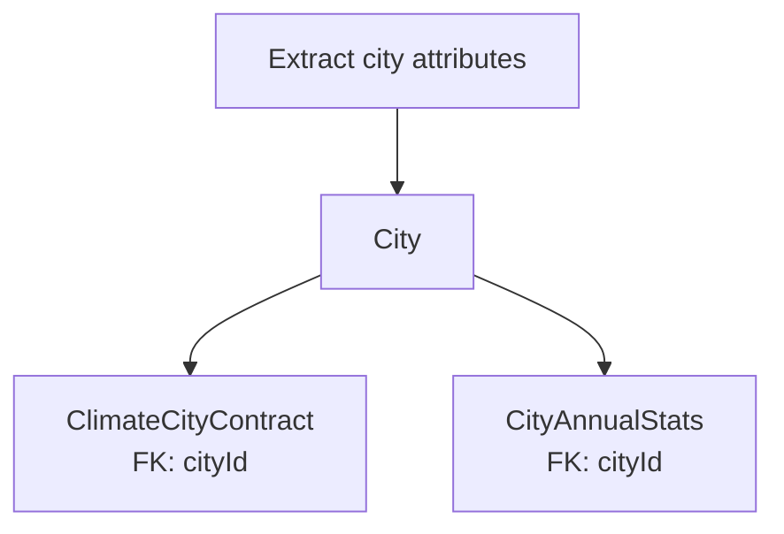
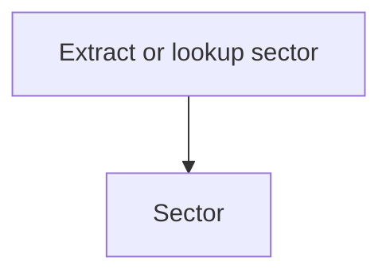
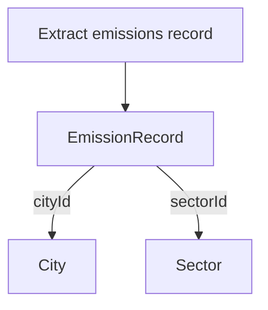
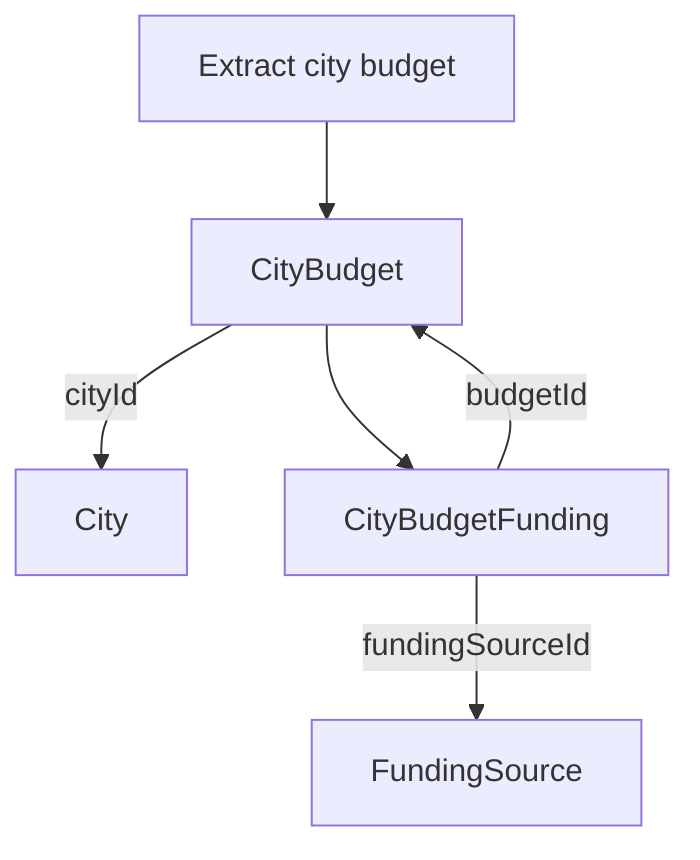
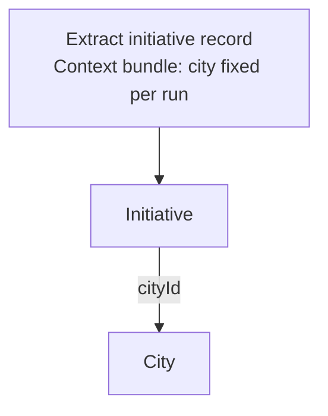
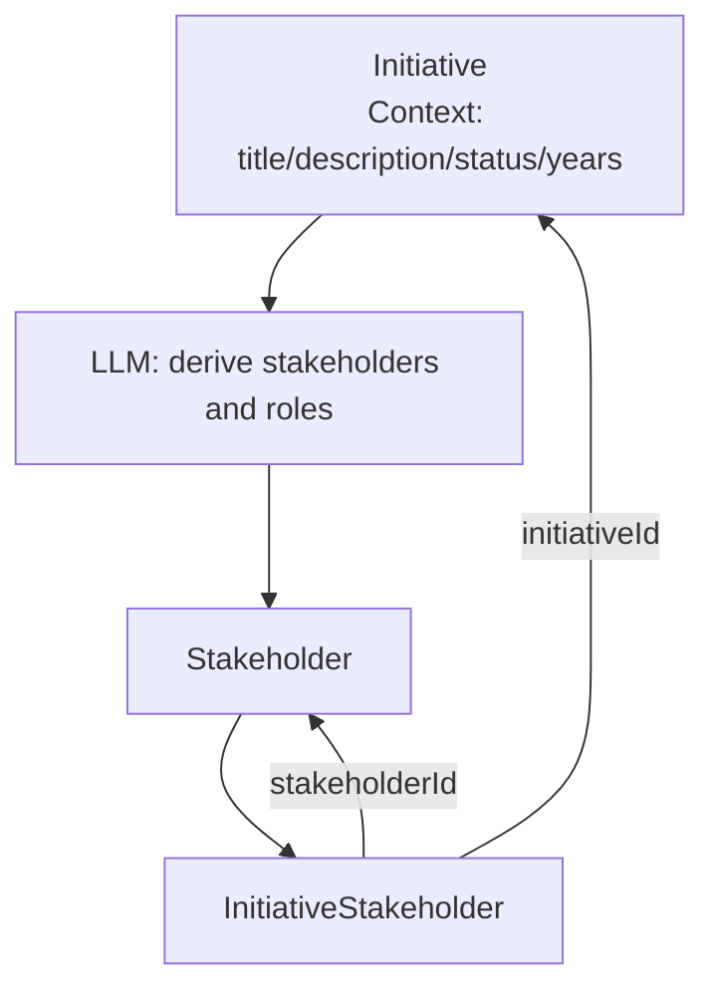
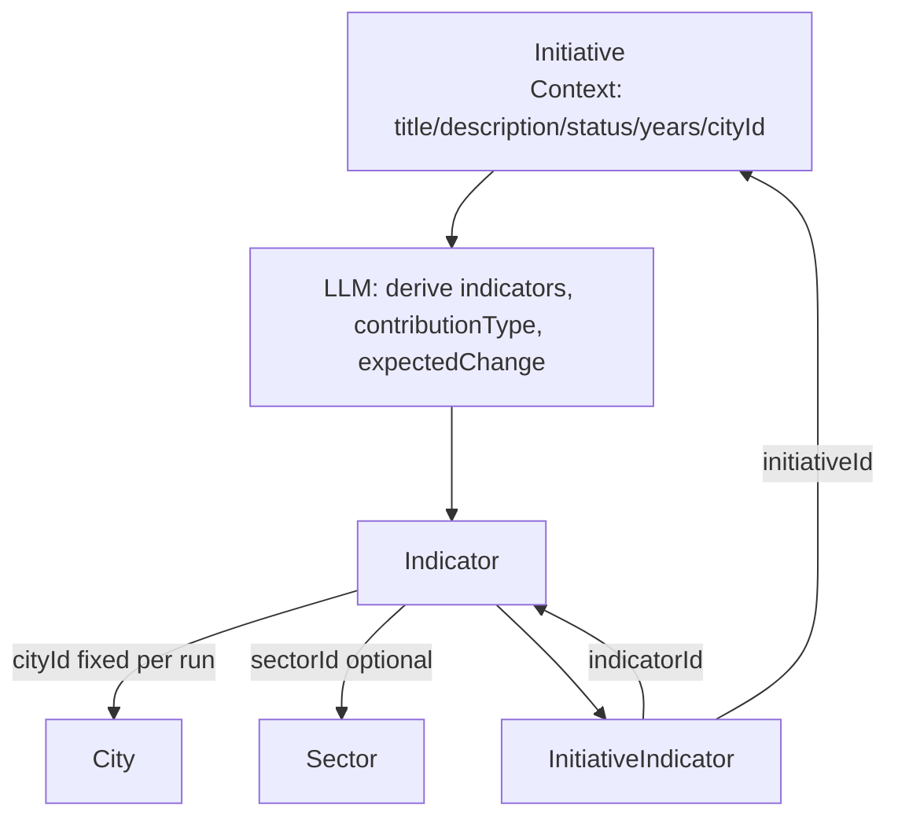
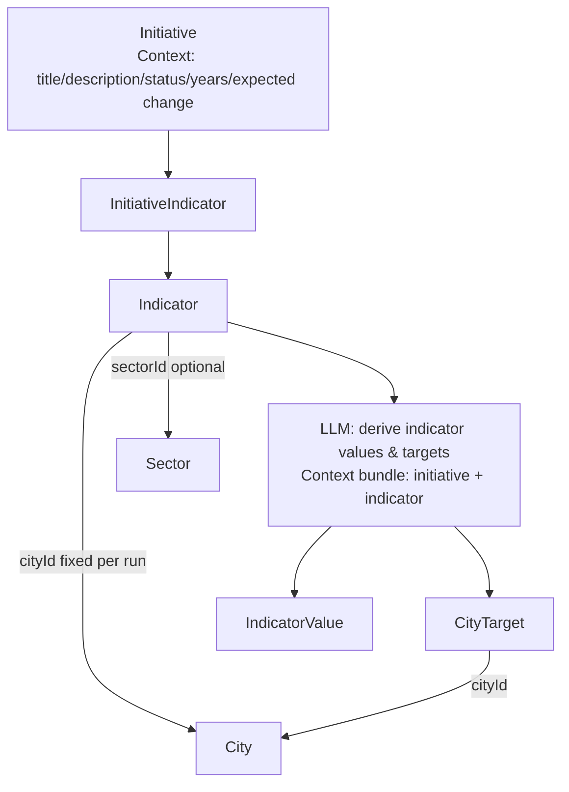
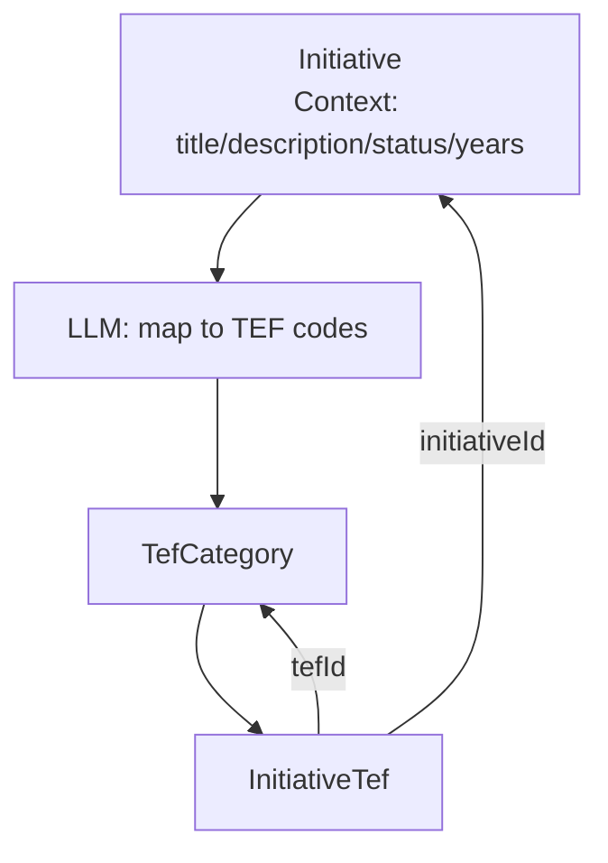

# Mapping Plan (step-by-step)

Each section shows one extraction and join path for every model in `database/schemas.py`. Use these as discrete prompts/steps rather than a single big graph. City is fixed for a run - map it automatically as the first step before other mappings and reuse that city for every `cityId` link.

## 1) City anchors
City fixed per run; resolve city once, then attach CCC and CAS to that city.

## 2) Sector taxonomy

## 3) Emissions time series
City fixed per run; reuse the pre-mapped city when linking emission records.

## 4) Budgets and funding
City fixed per run; link each city budget to the pre-mapped city.

## 5) Initiative core
City fixed per run; map city first, then link initiatives to that city.

## 6) Initiative -> Stakeholder

## 7) Initiative -> Indicator (cityId fixed per run)
City fixed per run; reuse the pre-mapped city when linking indicators (and downstream values/targets).

## 8) Indicator -> IndicatorValue / CityTarget (after Initiative->Indicator mapping)
City fixed per run; CityTarget uses the pre-mapped city.
Assumption: Indicator already exists and is linked to Initiative. Always pass the initiative context (title/description/status/years/expected change) when asking for values/targets so lineage is preserved.

## 9) Initiative -> TEF taxonomy

